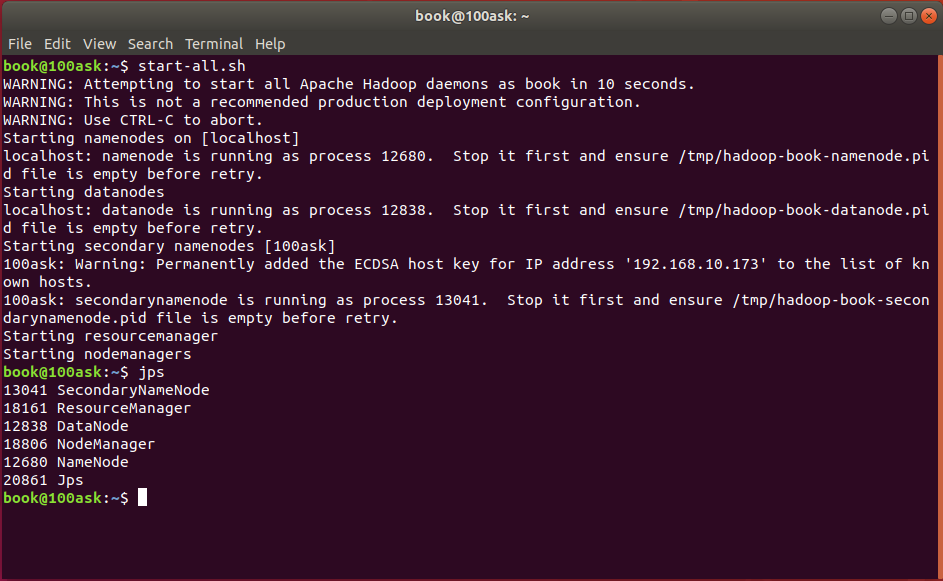
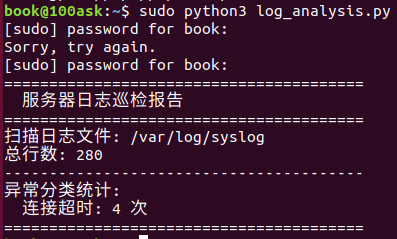

# Hadoop 环境部署验证 & Linux 日志自动化巡检

本项目包含两个用于服务器运维与基础组件部署验证的实践工具。

---

## 项目一：Hadoop 单机环境部署验证

- **环境**：Ubuntu 18.04 + Hadoop 3.x
- **任务**：完成 Hadoop 单机模式部署，验证 MapReduce 计算流程
- **验证方式**：执行 `jps` 命令确认 NameNode、DataNode、ResourceManager 等核心进程正常运行
- **成果**：成功跑通 WordCount 示例，输出详细部署排错文档

*上图：执行 jps 命令，五大核心进程均在运行*

---

## 项目二：Linux 系统日志自动化巡检工具

- **技术栈**：Python + 正则表达式 + Linux syslog + Crontab
- **功能**：自动扫描 `/var/log/syslog`，按错误类型（内存不足、磁盘写满、连接超时、服务崩溃等）分类统计异常日志出现频次
- **效果**：替代人工逐行查看，单次扫描覆盖万行级日志，配合 Crontab 实现每日自动巡检

*上图：脚本运行输出示例，统计各类异常日志出现次数*

---

## 代码与文档

- 所有脚本及排错笔记已归档至本仓库
- 具备规范的测试过程可追溯能力

**GitHub:** https://github.com/baozhenmao/data-analysis-projects
