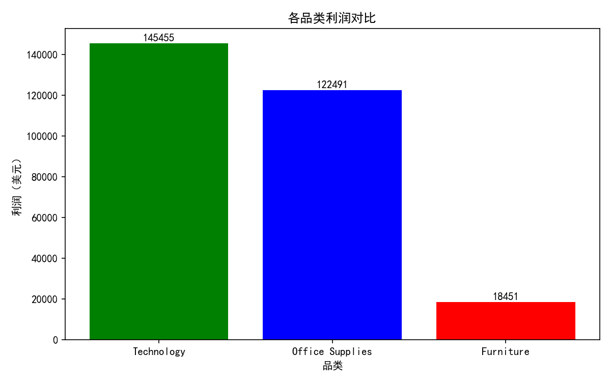
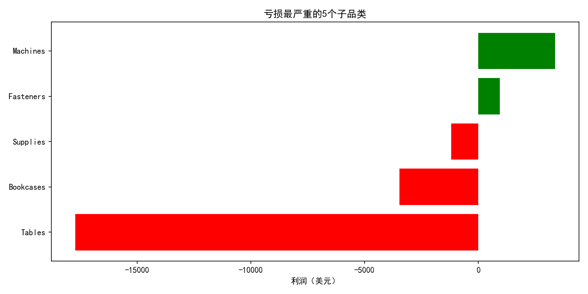
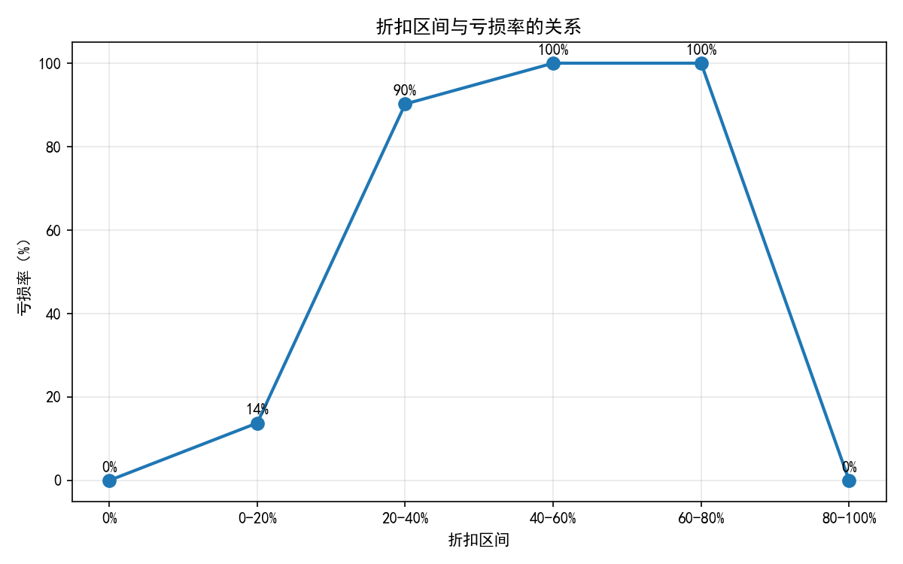

# 数据分析项目集

包含两个数据分析实战项目：

## 项目1：Hadoop WordCount
- 环境：VMware Ubuntu 18.04 + Hadoop 3.2.4
- 实现分布式词频统计，验证 MapReduce 原理

## 项目2：超市销售数据分析
- 数据：Superstore Sales（9994行 × 21列）
- 工具：Python + Pandas + Matplotlib
- 发现：折扣 > 20% 时亏损率从 13.8% 飙升至 90%+

## 图表预览

